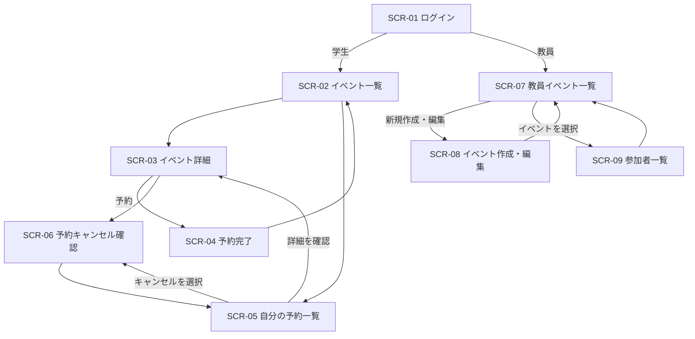

# 画面実装案

[要件・書記](書記.md)をもとに、学生の検索・予約と、教員のイベント作成・参加者管理を一通り実装できる画面構成案。PCとスマートフォンの両方で利用するWebアプリを想定する。

## 画面一覧

| 画面ID | 画面名 | 利用者 | 主な内容・操作 | 関連要件 |
|---|---|---|---|---|
| SCR-01 | ログイン | 学生・教員 | ログイン、利用者種別に応じた遷移 | UC-01〜04の開始条件 |
| SCR-02 | イベント一覧（ホーム） | 学生 | イベントカード、キーワード検索、タグ絞り込み、予約一覧への導線 | US-05、AC-05、FR-05、FR-06 |
| SCR-03 | イベント詳細 | 学生 | タイトル、日時、場所、詳細、タグ、予約ボタン | US-03、AC-03 |
| SCR-04 | 予約完了 | 学生 | 予約結果とイベント概要を表示し、一覧へ戻る | US-03、SC-02 |
| SCR-05 | 自分の予約一覧 | 学生 | 予約中のイベントを表示し、詳細・キャンセルへ進む | US-04、AC-04 |
| SCR-06 | 予約キャンセル確認 | 学生 | 対象イベントを確認しキャンセルを確定する | US-04、AC-04-2 |
| SCR-07 | 教員イベント一覧 | 教員 | 作成済みイベント、公開状態、参加者数、作成導線 | US-01、US-02 |
| SCR-08 | イベント作成・編集 | 教員 | タイトル、日程、時間、場所、詳細を入力して保存 | UC-01、AC-01、FR-01 |
| SCR-09 | 参加者一覧 | 教員 | 選択イベントの予約者一覧、個別予約の取消操作 | UC-02、AC-02、FR-02 |

## 画面遷移

## 操作と表示の要点

### 学生

- 一覧はスマートフォンで縦に読みやすいカード表示にする。カードにはタイトル、日時、場所、短い説明、タグを表示する。
- 検索欄とタグ絞り込みを一覧上部に置き、該当なしの場合は「条件に合うイベントはありません」と表示する。
- 予約ボタンを押したら、予約可能かを確認して結果を表示する。成功後は予約完了画面へ進む。
- 予約一覧では予約状態を明示し、各予約のキャンセル操作から確認画面へ進める。確認画面で確定すれば、一覧から2操作でキャンセルできる。イベント詳細の確認導線も残す。

### 教員

- 教員用一覧からイベント作成、既存イベントの編集、参加者一覧へ移動できるようにする。
- 作成フォームは必須項目を明示し、入力漏れは項目ごとにメッセージを表示する。
- 参加者一覧は氏名など必要な項目を列で揃え、予約者がいない場合は空状態の案内を表示する。

### 共通

- PCでは教員の一覧を表形式、学生のイベントを複数列カードにしてよい。スマートフォンでは1列にし、主要操作を画面幅内に収める。
- 読み込み中、通信失敗、権限不足、イベント終了・満員などの状態表示を用意する。満員制御など未確定の業務ルールはチーム合意後に反映する。

## 実装順案

1. SCR-01 ログインと利用者種別ごとの表示制御
2. SCR-02 イベント一覧と検索・タグ絞り込み
3. SCR-03 イベント詳細とSCR-04 予約完了
4. SCR-05 予約一覧とSCR-06 キャンセル確認
5. SCR-07 教員イベント一覧とSCR-08 作成・編集
6. SCR-09 参加者一覧

この順なら、学生がイベントを探して予約する流れを先に通し、その後に教員の作成・管理をつなげられる。

## 実装前に決めること

- ログイン方式と、学生・教員のアカウント判定方法
- 予約上限、定員、満員時の扱い
- 「同じ時間帯の別の予約」が学生本人の重複予約を指すのか、イベント側の競合を指すのか
- 学生に参加者情報を公開するか、教員が予約を取り消すときの扱い
- イベントの公開・編集・削除条件
- 成功条件の測定期間と基準値（参加率などの数値案に未確定部分がある）
